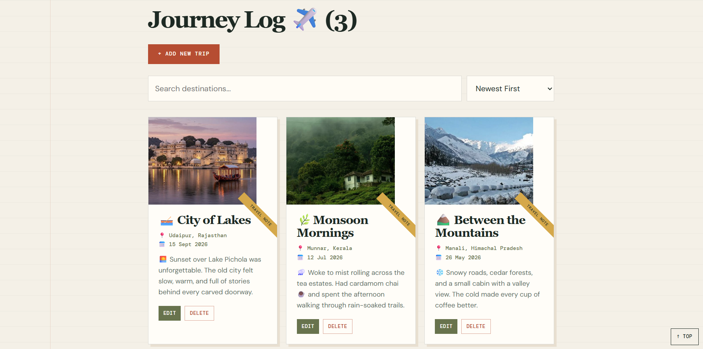
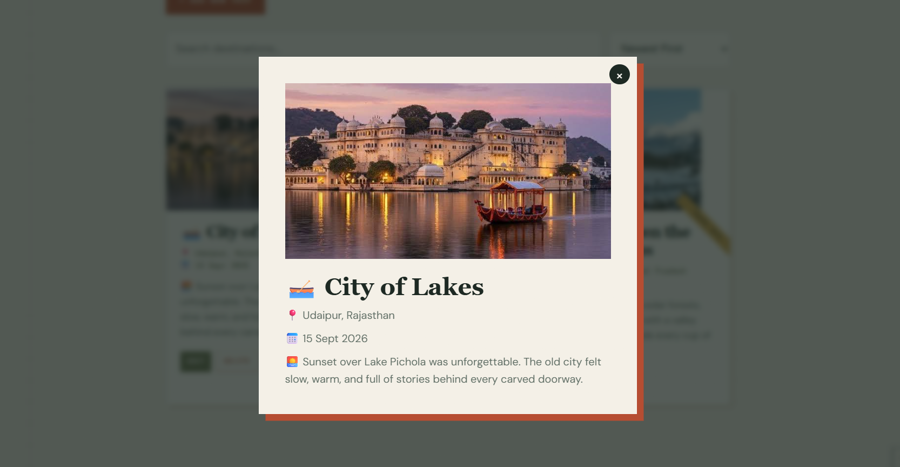
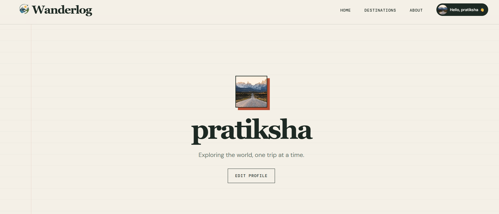

# Wanderlog — Your Personal Travel Journal

Wanderlog is a browser-based travel journal for collecting the small details that make a trip memorable: places, dates, photographs, and notes. Create an entry when you return home, revisit your archive later, and keep your travel stories in one calm, personal space.

> **Live demo:**


## Highlights

- Create, edit, and delete trip entries with a title, destination, date, notes, and optional cover photo.
- Preview uploaded photos before saving an entry.
- Browse an archive of trips and search or sort by date and title.
- Open any trip card for a full journal-entry view.
- Personalise a traveler profile with a name, bio, and avatar.
- Keep trip and profile data after refreshes with browser `localStorage`.
- Use comfortably on mobile, tablet, and desktop screens.

## A note on data

Wanderlog is a front-end-only project. Your entries and photos are stored in the browser on the device you use; they are not sent to a server or shared automatically. Clearing browser site data will remove them.

## Built with

- **HTML5** for semantic page structure
- **CSS3** for the journal-inspired visual system, responsive layouts, Grid, and Flexbox
- **Web APIs used:**
  - `FileReader` — for photo upload previews and Base64 conversion
  - `localStorage` — for persisting trips and profile data
  - `IntersectionObserver` — for scroll-triggered animations
  - `URLSearchParams` — for shareable profile links and edit/add routing

## Screens

| Travel archive                                    | Journal entry                                   | Profile                                 |
| ------------------------------------------------- | ----------------------------------------------- | --------------------------------------- |
|  |  |  |

## Run locally

Wanderlog has no dependencies or build step.

1. Clone the repository.

   ```bash
   git clone https://github.com/PratikshaaGaikwad/wonderlog.git
   ```

2. Move into the project folder.

   ```bash
   cd wonderlog
   ```

3. Open `index.html` in a browser.

For the smoothest local experience, serve the folder with an editor extension such as VS Code **Live Server**.

## Project structure

```s
wonderlog/
├── index.html           # Home page and new-trip form
├── destinations.html    # Searchable, sortable trip archive
├── profile.html         # Traveler profile and profile editing
├── style.css            # Shared journal-themed design system
├── script.js            # Rendering, CRUD, storage, and UI interactions
├── web_images/          # README screenshots
```

## How it works

Trip data is kept as an array in `localStorage`. When an entry is created or updated, Wanderlog re-renders the relevant trip cards. Uploaded images are read in the browser with `FileReader` and saved with the entry as Base64 data.

This makes the project easy to run anywhere, while also meaning it is best suited to personal, local use rather than multi-device syncing.

## Future ideas

- Export and import a journal backup
- Map view with trip pins
- Tags, favourites, and trip collections
- Cloud sync and authentication
- Richer entry layouts for itineraries and photo albums

## Author

Built by **Pratiksha Gaikwad**.

---

If you enjoy Wanderlog, consider giving the repository a star.
